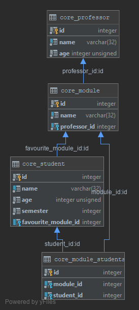

# Introduction to GraphQL and Graphene

## Workshop Outline
- _TypeDefs_
- _Query_
- _Mutation_
- _GraphQL Schema Language_

#### System Requirements
- [git](https://git-scm.com/) v2 or greater
- [python3.5](https://www.python.org/downloads/) or greater + pip

----
## Follow one of the installation instructions (1,2)
This is the minimum workshop setup. Please prepare the project as described below.

#### 1) Pre-Workshop Instructions/Requirements (install)
- `git clone https://github.com/Speedy1991/graphql_workshop.git`
- `cd graphql_workshop`
- If you want to use a virtual environment click [here](https://virtualenv.pypa.io/en/stable/userguide/) for instructions 
- `pip install -r requirements.txt`
- `python manage.py migrate`
- `python manage.py loaddata assets/initial` (_Installed 91 object(s) from 1 fixture(s)_)
- `python manage.py runserver`

#### 2) Pre-Workshop Instructions/Requirements (dockerized)
- `git clone https://github.com/Speedy1991/graphql_workshop.git`
- `cd graphql_workshop`
- `docker-compose up --force-recreate --build`

#### Test your setup
- Open your browser and visit `http://127.0.0.1:8000/admin` and try to login with `admin:12345`

----

## Exercise overview
1) Write your first TypeDefs and resolvers
2) Extend your TypeDefs with more complex resolvers
3) Refactor with `django-graphene`
4) Write a custom resolver
    * Add Query Arguments
5) Write a mutation
6) Refactor
    * Replace mutation arguments with an _InputType_
    * Use _EnumType_
7) Interfaces
8) Polymorphic & interfaces
9) Some LiveCoding with AbstractTypes, etc.

## Working through it
This is a very exercise-heavy workshop. You'll finde the exercises in the _graphql_workshop/exercise[number]_ directory.
Don't forget to change the used schema in the [settings](https://github.com/Speedy1991/graphql_workshop/blob/master/graphql_workshop/settings.py#L51).

You find some helpful content on the Docs:
- [graphene](https://docs.graphene-python.org/en/latest/types/)
- [django_graphene](https://docs.graphene-python.org/projects/django/en/latest/queries/)
- [django queries](https://docs.djangoproject.com/en/2.2/topics/db/queries/)

## Helpful shortcuts
- _TODO:_ This is **your** job
- _DOCS:_ This will give you a link to the specific doc page
- _DJANGO:_ This will help you with some django specific code
- _HINT:_ This will give you some useful tips
- _QUESTION:_ Try to answer the question yourself - if you don't find the answer, feel free to ask :)

## Django Cheatsheet
- `SELECT * FROM <table>` -> `<ModelName>.objects.all()`
- `SELECT * FROM <table> WHERE id=<id>` -> `<ModelName>.objects.get(id=id)` (raises if not exist)

## Database overview

#### License
This material is available for private, non-commercial use under the [GPL version 3](https://www.gnu.org/licenses/gpl-3.0-standalone.html).

If you would like to use this material to conduct your own workshop, please contact me at arthur.holz.91@gmail.com
