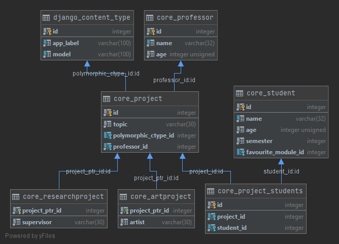

# Exercise 8

Fix the [schema](https://github.com/Speedy1991/graphql_workshop/blob/master/graphql_workshop/settings.py#L55): `exercise8.schema.schema`

## Interfaces

Refactor to use Django Polymorphic models

## Database overview



## TODO

- [query.py](https://github.com/Speedy1991/graphql_workshop/blob/master/exercise8/schema/types.py)
- [types.py](https://github.com/Speedy1991/graphql_workshop/blob/master/exercise8/schema/__init__.py)


## Sample

Query:
```
{
  professors {
    id
    name
    projects {
      id
      topic
      students {
        id
        name
      }
      __typename
      ... on ResearchProjectType {
        supervisor
      }
      ... on ArtProjectType {
        artist
      }
    }
  }
}
```

Result:

```
{
  "data": {
    "professors": [
      {
        "id": "1",
        "name": "Prof. Olivia",
        "projects": []
      },
      {
        "id": "2",
        "name": "Prof. Jacob",
        "projects": [
          {
            "id": "7",
            "topic": "Department Party 2",
            "students": [
              {
                "id": "3",
                "name": "Mia"
              },
              {
                "id": "4",
                "name": "Peter"
              },
              {
                "id": "5",
                "name": "Natalie"
              },
              {
                "id": "6",
                "name": "Ang"
              }
            ],
            "__typename": "ArtProjectType",
            "artist": "T. Turner"
          },
          {
            "id": "8",
            "topic": "Painting with Tim",
            "students": [],
            "__typename": "ArtProjectType",
            "artist": "Tim B."
          }
        ]
      },
      ...
```
